# Ocean Simulator

[](https://github.com/dotnetspark/OceanSimulator/actions/workflows/squad-ci.yml)
[](https://github.com/dotnetspark/OceanSimulator/actions/workflows/e2e.yml)
[](LICENSE)
[](https://dotnet.microsoft.com/)
[](https://nodejs.org/)

A full-stack marine ecosystem simulator.A 2D grid of ocean cells evolves through **Snapshots** — each specimen moves once per snapshot in randomized order, following species-specific predator-prey behaviors.

## Stack


## Species & Food Chain

```mermaid
graph LR
    Plankton["🌿 Plankton<br/>Random movement<br/>Breeds always"]
    Sardine["🐟 Sardine<br/>Eats Plankton<br/>Starves if hungry"]
    Shark["🦈 Shark<br/>Eats Sardines<br/>Attacks rivals when hungry"]
    Crab["🦀 Crab<br/>Scavenges dead<br/>Immortal"]
    Reef["🪨 Reef<br/>Static obstacle"]
    Dead["💀 Dead Bodies<br/>Crab food"]
    
    Plankton -->|Eaten by| Sardine
    Sardine -->|Eaten by| Shark
    Sardine -->|Dies| Dead
    Shark -->|Dies| Dead
    Dead -->|Consumed by| Crab
    
    style Plankton fill:#90EE90
    style Sardine fill:#FFB6C1
    style Shark fill:#FF6347
    style Crab fill:#FFD700
    style Reef fill:#A9A9A9
    style Dead fill:#8B0000,color:#fff
```



**Species Behaviors:**
- **Plankton:** Moves to random Water cell, breeds on every move
- **Sardine:** Eats Plankton or moves to Water, starves without food
- **Shark:** Eats Sardines, attacks rival Sharks when starving, breeds
- **Crab:** Scavenges dead specimens; cannot starve or breed
- **Reef:** Static obstacle; never moves

## Running the Project

The project uses **.NET Aspire** for orchestration. A single command starts everything — the backend API, the Vite frontend, and the YARP reverse proxy.

### Prerequisites
- [.NET 10 SDK](https://dotnet.microsoft.com/download)
- [Docker Desktop](https://www.docker.com/products/docker-desktop/) — required for the YARP reverse proxy container
- [Node.js 18+](https://nodejs.org/)
- [.NET Aspire workload](https://learn.microsoft.com/dotnet/aspire/fundamentals/setup-tooling): `dotnet workload install aspire`

### Start

```bash
dotnet run --project backend/OceanSimulator.AppHost
```

This launches:
- 🔧 **Backend API** (internal, routed via proxy)
- ⚡ **Vite dev server** (internal, static files served via proxy)
- 🌐 **YARP Proxy** — the single exposed endpoint for the app
- 📊 **Aspire Dashboard** at `http://localhost:15888` — logs, traces, health checks

The app is available at the proxy URL shown in the Aspire dashboard.

## Testing

### Backend unit + integration tests

```bash
cd backend
dotnet test
```

### Frontend unit tests (Vitest)

```bash
cd frontend
npm run test
```

### End-to-end tests (Playwright)

```bash
# Start backend and frontend first, then:
cd frontend
npx playwright test
```

## Architecture

### Frontend Component Tree


See [docs/ARCHITECTURE.md](docs/ARCHITECTURE.md) for the full Clean Architecture diagram, design pattern inventory, species behavior matrix, and snapshot execution flow.

## Extending

### Add a new species
Follow the steps in [docs/ARCHITECTURE.md#adding-a-new-species](docs/ARCHITECTURE.md#adding-a-new-species).
All behavior is polymorphic — no existing code changes required except registration in `SpecimenFactory` and the SVG component.

### Modify breeding / starvation rules
Edit the relevant entity's `ExecuteMove` method in `OceanSimulator.Domain/Entities/`. No other changes needed.

## License

MIT
