# Ocean Simulator

A full-stack marine ecosystem simulator. A 2D grid of ocean cells evolves through **Snapshots** — each specimen moves once per snapshot in randomized order, following species-specific predator-prey behaviors.

## Stack


## Species & Food Chain

```mermaid
graph LR
    Plankton["🌿 Plankton<br/>Random movement<br/>Breeds always"]
    Sardine["🐟 Sardine<br/>Eats Plankton<br/>Starves if hungry"]
    Shark["🦈 Shark<br/>Eats Sardines<br/>Attacks rivals when hungry"]
    Crab["🦀 Crab<br/>Scavenges dead<br/>Immortal"]
    Reef["🪨 Reef<br/>Static obstacle"]
    Dead["💀 Dead Bodies<br/>Crab food"]
    
    Plankton -->|Eaten by| Sardine
    Sardine -->|Eaten by| Shark
    Sardine -->|Dies| Dead
    Shark -->|Dies| Dead
    Dead -->|Consumed by| Crab
    
    style Plankton fill:#90EE90
    style Sardine fill:#FFB6C1
    style Shark fill:#FF6347
    style Crab fill:#FFD700
    style Reef fill:#A9A9A9
    style Dead fill:#8B0000,color:#fff
```



**Species Behaviors:**
- **Plankton:** Moves to random Water cell, breeds on every move
- **Sardine:** Eats Plankton or moves to Water, starves without food
- **Shark:** Eats Sardines, attacks rival Sharks when starving, breeds
- **Crab:** Scavenges dead specimens; cannot starve or breed
- **Reef:** Static obstacle; never moves

## Getting Started

### Prerequisites
- .NET 8 SDK
- Node.js 20+
- (Optional) Visual Studio 2022 or VS Code

### Quick Start with .NET Aspire (Recommended)

The easiest way to run the full stack locally:

```bash
cd backend
dotnet run --project OceanSimulator.AppHost
```

This launches the **Aspire Dashboard** at `http://localhost:15299` (or similar), which orchestrates:
- Backend API (with auto-assigned port and service discovery)
- Vite frontend dev server (port 5173)
- Telemetry, logs, and health checks in one unified dashboard

### Run Projects Individually (Alternative)

#### Backend

```bash
cd backend
dotnet restore
dotnet run --project OceanSimulator.Api
# API available at http://localhost:5030
# Swagger UI at http://localhost:5030/swagger
```

#### Frontend

```bash
cd frontend
npm install
cp .env.example .env   # edit VITE_API_URL if needed
npm run dev
# App at http://localhost:5173
```

#### Run Both (Manual Method)

```bash
# Terminal 1 — backend
cd backend && dotnet run --project OceanSimulator.Api

# Terminal 2 — frontend
cd frontend && npm run dev
```

## Testing

### Backend unit + integration tests

```bash
cd backend
dotnet test
```

### Frontend unit tests (Vitest)

```bash
cd frontend
npm run test
```

### End-to-end tests (Playwright)

```bash
# Start backend and frontend first, then:
cd frontend
npx playwright test
```

## Architecture

### Frontend Component Tree


See [docs/ARCHITECTURE.md](docs/ARCHITECTURE.md) for the full Clean Architecture diagram, design pattern inventory, species behavior matrix, and snapshot execution flow.

## Extending

### Add a new species
Follow the steps in [docs/ARCHITECTURE.md#adding-a-new-species](docs/ARCHITECTURE.md#adding-a-new-species).
All behavior is polymorphic — no existing code changes required except registration in `SpecimenFactory` and the SVG component.

### Modify breeding / starvation rules
Edit the relevant entity's `ExecuteMove` method in `OceanSimulator.Domain/Entities/`. No other changes needed.

## License

MIT
