# Ocean Simulator — Architecture

## Clean Architecture Layers

```mermaid
graph TB
    API["🌐 API Layer<br/>SimulationController<br/>SimulationHub<br/>SignalR Events"]
    Infra["💾 Infrastructure Layer<br/>SeededRandomProvider<br/>JsonOceanRepository<br/>SignalREventPublisher"]
    App["⚙️ Application Layer<br/>SnapshotOrchestrator<br/>SpecimenFactory<br/>OceanBuilder"]
    Domain["🧬 Domain Layer<br/>Entities, Interfaces<br/>Value Objects, Events<br/>ISpecimen, IOcean"]
    
    API -->|Depends on| Infra
    Infra -->|Depends on| App
    App -->|Depends on| Domain
    Domain -->|No dependencies|Domain
    
    style API fill:#4A90E2
    style Infra fill:#F5A623
    style App fill:#7ED321
    style Domain fill:#FF6B6B
```

**Dependency rule:** Outer layers depend on inner layers. Domain has ZERO external dependencies — clean boundary maintained.

## Design Patterns

```mermaid
graph LR
    Poly["🔄 Polymorphism<br/>ExecuteMove overrides<br/>per species"]
    Factory["🏭 Factory<br/>SpecimenFactory<br/>Creates all types"]
    Template["📋 Template Method<br/>SnapshotOrchestrator<br/>Get→Shuffle→Process<br/>→Reset→Count→Publish"]
    Observer["👁️ Observer/Events<br/>OceanEvent hierarchy<br/>→ SignalREventPublisher"]
    Repository["💾 Repository<br/>IOceanRepository<br/>→ JsonOceanRepository"]
    Builder["🔨 Builder<br/>OceanBuilder<br/>BuildRandom()"]
    
    style Poly fill:#FFD93D
    style Factory fill:#6BCB77
    style Template fill:#4D96FF
    style Observer fill:#FF6B9D
    style Repository fill:#A29BFE
    style Builder fill:#FD79A8
```

**Pattern descriptions:**
- **Polymorphism:** Each species overrides `ExecuteMove` — no switch/if-else on type in movement logic
- **Factory:** Config-driven creation of all specimen types with threshold-based behavior
- **Template Method:** Fixed snapshot steps ensure consistent execution order
- **Observer:** Decoupled event publishing to frontend via SignalR
- **Repository:** Abstracted ocean state persistence (JSON serialization)
- **Builder:** Fluent API for complex ocean construction

## Entity Hierarchy

## Species Behavior Matrix

| Species | Moves | Eats | Breeds | Starves | Attacks |
|---------|-------|------|--------|---------|---------|
| Plankton | Random Water | — | ✅ counter | ❌ | ❌ |
| Sardine | Plankton > Water | Plankton | ✅ counter | ✅ energy | ❌ |
| Shark | Sardine > (attack) > Water | Sardine | ✅ counter | ✅ energy | ✅ by weight |
| Crab | Dead > Water | Dead specimens | ❌ | ❌ | ❌ |
| Reef | Never | — | ❌ | ❌ | ❌ |

### Movement Priority & State Machine

```mermaid
stateDiagram-v2
    [*] --> Ready: Specimen begins turn
    
    Ready --> SearchFood: EnergeticSpecimen & hungry?
    Ready --> SearchFood: EnergeticSpecimen & healthy?
    Ready --> SearchDead: Crab only
    Ready --> Static: Reef
    
    SearchFood --> Found: Target cell exists
    SearchFood --> NotFound: No target cell
    
    NotFound --> MoveRandom: Move to random Water
    
    Found --> Consume: Move to target cell
    Consume --> ProcessEnergy: Eat food
    ProcessEnergy --> CheckBreed: Decrement energy
    
    MoveRandom --> ProcessBreed: Increment breeding counter
    ProcessBreed --> CheckStarve: Check if starving
    
    Consume --> ProcessBreed
    ProcessBreed --> CheckStarve
    
    SearchDead --> FoundDead: Dead specimen adjacent?
    FoundDead --> ConsumeDead: Move & eat
    NotDead: No dead bodies
    SearchDead --> NotDead
    NotDead --> MoveRandom
    
    CheckStarve --> Die: Energy ≤ 0
    CheckStarve --> Breed: Breeding counter ≥ threshold
    CheckStarve --> [*]: Turn complete
    
    Breed --> CreateOffspring: Breeding succeeds
    CreateOffspring --> ResetBreeding: Counter = 0
    ResetBreeding --> [*]
    
    Die --> DeadEntity: Transition to dead
    DeadEntity --> [*]
    
    Static --> [*]: Reef never moves
```

## Snapshot Execution Flow

```mermaid
flowchart TD
    Start["🎬 Snapshot Begins<br/>N specimens in Ocean"] --> GetAll["1️⃣ Get all living<br/>specimens"]
    GetAll --> Shuffle["2️⃣ Randomize order<br/>using IRandomProvider"]
    Shuffle --> Iterate["3️⃣ Iterate in<br/>shuffled order"]
    
    Iterate --> ExecuteMove["Execute specimen.ExecuteMove<br/>- Move to new cell<br/>- Eat food if adjacent<br/>- Breed if threshold met<br/>- Die if starved"]
    
    ExecuteMove --> OffspringQueue["Offspring born?<br/>Added to queue"]
    OffspringQueue --> NextSpecimen{"More specimens<br/>in snapshot?"}
    
    NextSpecimen -->|Yes| ExecuteMove
    NextSpecimen -->|No| ResetCounters["4️⃣ Reset breeding<br/>counters for<br/>next snapshot"]
    
    ResetCounters --> Count["5️⃣ Count population<br/>by species"]
    Count --> Publish["6️⃣ Publish events<br/>via SignalR<br/>to frontend"]
    Publish --> End["✅ Snapshot Complete<br/>Offspring move next<br/>snapshot"]
    
    style Start fill:#4ECDC4,color:#000
    style GetAll fill:#95E1D3,color:#000
    style Shuffle fill:#95E1D3,color:#000
    style Iterate fill:#95E1D3,color:#000
    style ExecuteMove fill:#FFA07A,color:#000
    style OffspringQueue fill:#FFA07A,color:#000
    style ResetCounters fill:#FFB6C1,color:#000
    style Count fill:#FFB6C1,color:#000
    style Publish fill:#DDA0DD,color:#000
    style End fill:#90EE90,color:#000
```

**Key insight:** Offspring created during a snapshot don't move until the next snapshot — this prevents feedback loops and ensures deterministic behavior.

### ✅ Single Responsibility
- Each entity owns its own movement behavior via `ExecuteMove`
- `SnapshotOrchestrator` orchestrates snapshot flow only
- `SpecimenFactory` handles creation only
- `Ocean` manages grid state only

### ✅ Open/Closed
- New species: add entity + register in factory. No existing code changes required (except factory registration)
- Behavior is polymorphic — `ExecuteMove` overrides, not conditionals

### ✅ Liskov Substitution
- All `Specimen` subtypes substitutable via `ISpecimen` interface
- `LivingSpecimen` and `EnergeticSpecimen` add capabilities without breaking base contracts

### ✅ Interface Segregation
- `IOcean`, `ISpecimen`, `IRandomProvider`, `ISpecimenFactory`, `IOceanEventPublisher`, `IOceanRepository` — each focused on one concern

### ✅ Dependency Inversion
- Domain depends on abstractions only (interfaces)
- Infrastructure provides implementations injected via DI
- Domain.csproj has zero `ProjectReference` or external `PackageReference`

### ⚠️ Tech Debt
- `SnapshotOrchestrator.CreateOffspring` duplicates `SpecimenFactory` switch logic. Should inject `ISpecimenFactory` to respect DRY and SRP.
- `colorTheme` prop declared on all SVG components but unused — wire up when high-contrast theme is needed.

## Adding a New Species

1. Create entity in `OceanSimulator.Domain/Entities/` extending `Specimen` (or `LivingSpecimen`/`EnergeticSpecimen`)
2. Override `ExecuteMove` with species-specific behavior
3. Add `SpecimenType` enum value
4. Register in `SpecimenFactory`
5. Add SVG component in `frontend/src/components/species/`
6. Wire in `GridCell.tsx`
7. Add tests in `OceanSimulator.Tests/Domain/`
